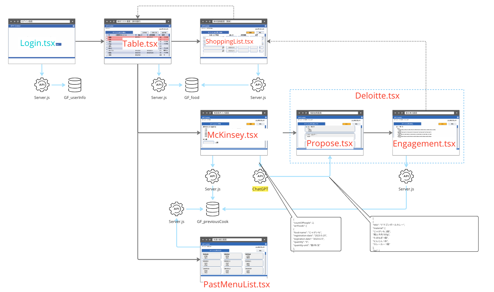
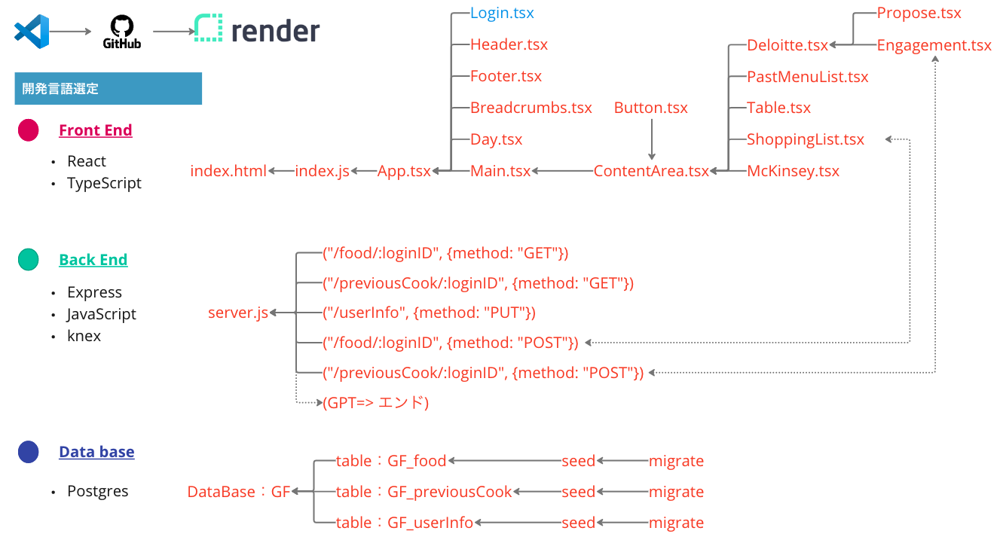
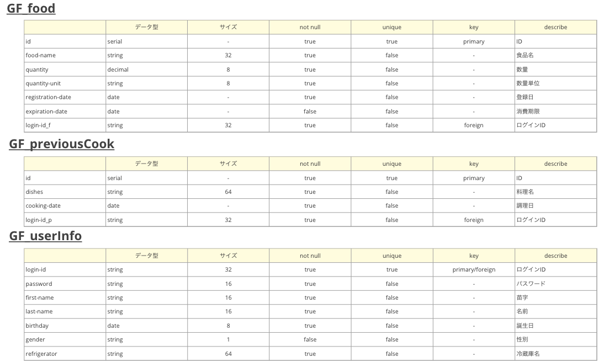

# 【 GPTCooker🥘 ザマス について】

### 【Git 情報】


---

### 【使用アイテム】

<div>


</div>

<hr>

## 🥘 システム概要

このシステムは「栄養バランス提案（献立提案）」を行います。

### 🥘 背景

下記内容からこのシステムを作成するプロジェクトが開始しました。

- **【困りごと】** 毎日、「メニューを考えるのが大変」でこんな困りごとありませんか？
  - 限られた材料で作らないといけない
  - 被らない料理を作らないといけない
- **【欲しいシステム】** 簡単＆かぶらない献立提案・食材管理（ムダにしない）

**_使用 URL_**

実際のシステム[「GPTCooker🥘 ザマス」](https://vermouth.onrender.com/)はこちらになります。

## 🥘 機能

- 食材を登録
- 数量や賞味期限管理
- 指定した食材から**自動で献立**を 3 つ提案
- 過去の献立リストを一覧表示

## 🥘 アーキテクチャー

※<font color="Red">赤文字部</font>：作成済　　<font color="blue">青文字部</font>：未作成


## プログラム構成

※<font color="Red">赤文字部</font>：作成済　　<font color="blue">青文字部</font>：未作成


## スキーマ



## 使用環境

- macOS
- node.js
- PostgreSQL

## 🥘 必要要件

- 🔑 Chat GPT の API キーを取得し、.env に設定

## 🥘 使い方

1. ライブラリを `npm i` でインストールしてください。
2. その他起動方法は、[React のドキュメント](/README_Install.ja.md)を参照してください。

## 🥘 インストール

```
$ git clone https://github.com/〜〜
$ cd 〜〜
```

## 🥘 テスト

1. 追加中

## 🥘 デプロイ

1. とくになし

## 🥘 その他

ユーモアのある料理を提案してくれるのでぜひ使ってみてください。

## 🥘 作者

- Team1（萩 巧実、森﨑 陽平、坂本 龍征、皿井 進）
- Team2（久場 智宏、田邊 諒人、菊地 慧、宮城 恒太郎）

## 🥘 今後の計画

- [ ] ログイン画面
- [ ] 数量計算
- [ ] 賞味期限が近づいたら通知
- [ ] 食べたいものから足りない食材を提案
- [ ] お気に入り登録
